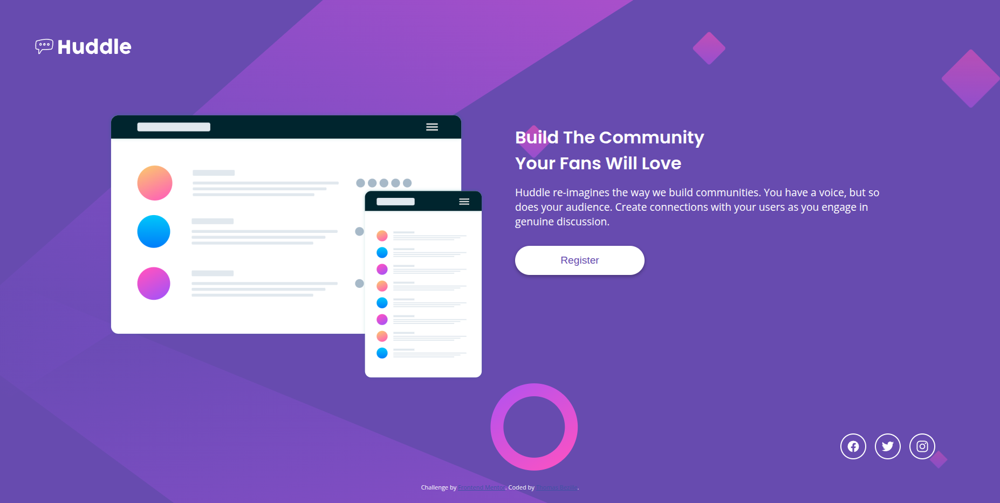

# Huddle landing page with a single introductory section

> Intégration responsive d'une landing page d'introduction pour Huddle, réalisée à partir des maquettes fournies par Frontend Mentor.

**🔗 [Demo en ligne](https://front-end-mentor-huddle-landing-pag.vercel.app/)**

---

## 🎯 Objectif

Ce projet est une solution au challenge "Huddle landing page with a single introductory section" proposé par Frontend Mentor, une plateforme d'exercices d'intégration à partir de maquettes professionnelles. L'objectif est de reproduire fidèlement le design fourni en assurant une intégration responsive et un code propre, dans des conditions proches d'un projet réel.

**Ce que j'ai appris :**

- **HTML sémantique** : utilisation de balises adaptées (`header`, `main`, `footer`, `section`) pour une structure accessible et optimisée pour le SEO
- **SCSS / Sass** : architecture modulaire avec variables, partials et mixins pour un code maintenable et réutilisable
- **Responsive design** : approche mobile-first avec une bascule vers le desktop gérée via media queries
- **Mixins SCSS** : création d'une mixin réutilisable pour centraliser la gestion des breakpoints
- **Flexbox / CSS Grid** : mise en page moderne et flexible adaptée à tous les écrans
- **Intégration pixel-perfect** : reproduction fidèle de la maquette fournie (typographie, couleurs, espacements)
- **Gestion des assets** : intégration optimisée des images et icônes
- **Versionnement Git** : utilisation de commits atomiques et de messages clairs

---

## 🛠️ Stack

---

## 👤 Contact

**Thomas Bezille** — Développeur web à Nantes

